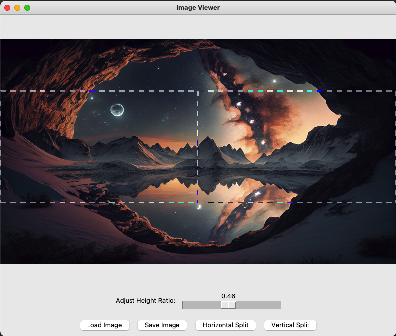
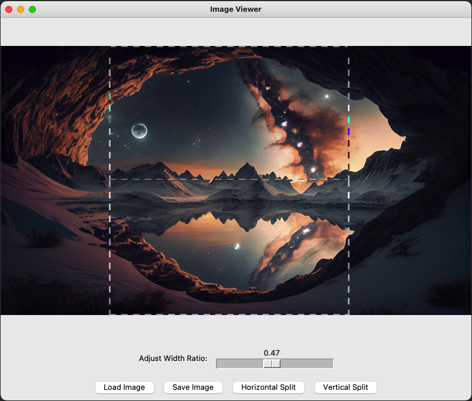

# Multi-Screen Wallpaper Splitter

[English](#project-description) | [中文](#項目描述)

## Project Description
This application is a Multi-Screen Wallpaper Splitter designed to help users easily split and adjust wallpapers for multi-monitor setups. It provides a graphical user interface for loading, splitting, adjusting, and saving wallpaper images across multiple screens.

## Features
- Load and display images
- Automatically detect multi-screen configurations
- Split images horizontally or vertically based on screen layouts
- Adjust split ratios with an interactive slider
- Preview split results in real-time
- Save split images individually

## Installation

### Prerequisites
- Python 3.x
- PIL (Python Imaging Library)
- tkinter
- screeninfo

### Steps
1. Clone this repository or download the source code.
2. Install the required dependencies:
   ```
   pip install pillow tkinter screeninfo
   ```
3. Run the main script:
   ```
   python main.py
   ```

## Usage
1. Launch the application by running `main.py`.
2. Click "Load Image" to select a wallpaper image. Supported formats include PNG, JPG, JPEG, GIF, and BMP.
3. Choose "Horizontal Split" or "Vertical Split" based on your screen arrangement:
   - "Horizontal Split" is suitable for multi-screen setups arranged side by side.
   - "Vertical Split" is suitable for multi-screen setups arranged one above the other.

*Figure 1: Example of horizontal split for side-by-side screen arrangement*

*Figure 2: Example of vertical split for stacked screen arrangement*
4. Use the slider to adjust the split ratio. The slider ranges from 0 to 1:
   - For horizontal splits, moving the slider to the right shifts the split line downwards.
   - For vertical splits, moving the slider to the right shifts the split line to the right.
5. Preview the split result in real-time. You'll see dashed lines indicating the split and preview areas for each screen.
6. When satisfied with the split result, click the "Save Image" button.
7. Choose a save location and filename. The system will automatically number each split image (e.g., wallpaper_1.png, wallpaper_2.png).
8. After saving, you'll see a success message indicating the number of images saved.
9. You can now set these split images as individual wallpapers for each of your screens using your operating system's display settings.

## File Structure
- `main.py`: Contains the main application logic and GUI.
- `utils/split_wallpaper.py`: Includes utility functions for splitting wallpapers and handling screen information.

## Contributing
Contributions to improve the application are welcome. Please feel free to submit pull requests or open issues for bugs and feature requests.

## License
This project is licensed under the MIT License - see the [LICENSE](LICENSE) file for details.

---

# 多屏幕壁紙分割器

## 項目描述
這個應用程序是一個多屏幕壁紙分割器,旨在幫助用戶輕鬆地為多顯示器設置分割和調整壁紙。它提供了一個圖形用戶界面,用於加載、分割、調整和保存跨多個屏幕的壁紙圖像。

## 功能
- 加載和顯示圖像
- 自動檢測多屏幕配置
- 根據屏幕布局水平或垂直分割圖像
- 使用交互式滑塊調整分割比例
- 實時預覽分割結果
- 單獨保存分割後的圖像

## 安裝

### 前提條件
- Python 3.x
- PIL (Python 圖像庫)
- tkinter
- screeninfo

### 步驟
1. 克隆此存儲庫或下載源代碼。
2. 安裝所需的依賴項:
   ```
   pip install pillow tkinter screeninfo
   ```
3. 運行主腳本:
   ```
   python main.py
   ```

## 使用方法
1. 運行 `main.py` 啟動應用程序。
2. 點擊"加載圖像"選擇壁紙圖像。支持的格式包括PNG、JPG、JPEG、GIF和BMP。
3. 根據您的屏幕排列選擇"水平分割"或"垂直分割":
   - "水平分割"適用於並排排列的多屏幕設置。
   - "垂直分割"適用於上下排列的多屏幕設置。
4. 使用滑塊調整分割比例。滑塊範圍從0到1:
   - 對於水平分割,向右移動滑塊會將分割線向下移動。
   - 對於垂直分割,向右移動滑塊會將分割線向右移動。
5. 實時預覽分割結果。您將看到虛線指示分割線和每個屏幕的預覽區域。
6. 對分割結果滿意後,點擊"保存圖像"按鈕。
7. 選擇保存位置和文件名。系統將自動為每個分割的圖像編號(例如,wallpaper_1.png, wallpaper_2.png)。
8. 保存後,您將看到一條成功消息,指示保存的圖像數量。
9. 現在,您可以使用操作系統的顯示設置將這些分割的圖像設置為每個屏幕的單獨壁紙。

## 文件結構
- `main.py`: 包含主要應用程序邏輯和GUI。
- `utils/split_wallpaper.py`: 包括用於分割壁紙和處理屏幕信息的實用函數。

## 貢獻
歡迎提供改進應用程序的貢獻。請隨時提交拉取請求或為錯誤和功能請求開啟問題。

## 許可證
該項目根據MIT許可證授權 - 有關詳細信息,請參閱[LICENSE](LICENSE)文件。
